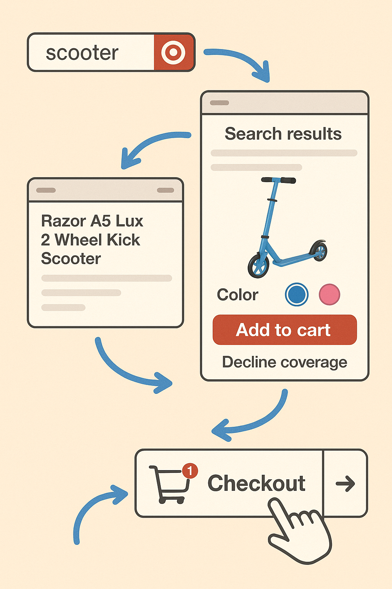

# Arcade Flow Analysis Report

*Generated on: 2025-10-15 23:24:24*

## User Journey Steps

User's Journey:
1. Clicked on 'search' to start looking for a product, searching for "Scooter".
2. Typed text.
3. Scrolled the page.
4. Clicked on 'Razor A5 Lux 2 Wheel Kick Scooter' to learn more about its features and see all available options.
5. Scrolled the page.
6. Clicked on 'Blue' to choose the preferred color for the scooter selection.
7. Clicked on 'Pink' to explore more color choices.
8. Clicked on 'Add to cart' to secure the selected scooter before it sells out.
9. Clicked on 'Decline coverage' to not add a protection plan at the moment.
10. Clicked on '1' to visit the cart, review the selected items, and proceed to checkout.
11. Performed a dragging action.

## Summary

The user began their journey by searching for a "Scooter" on the website. After typing in the search query, they scrolled through the search results and clicked on the 'Razor A5 Lux 2 Wheel Kick Scooter' to learn more about its features and see the available options. While on the product page, they scrolled further and selected the 'Blue' color option, then explored more color choices by clicking on 'Pink'. Satisfied with their selection, they added the scooter to the cart to secure it before it sells out. They declined adding a protection plan at that moment and proceeded to the cart by clicking on '1'. Finally, they performed a dragging action, possibly to rearrange or review the items in the cart before proceeding to checkout.

## Flow Marketing Visualization (Generated with OpenAI's Image API and gpt-image-1 model)

---
*This report was generated by the Arcade Flow Analyzer*

